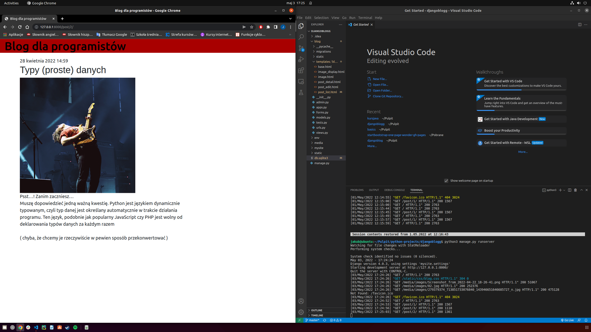
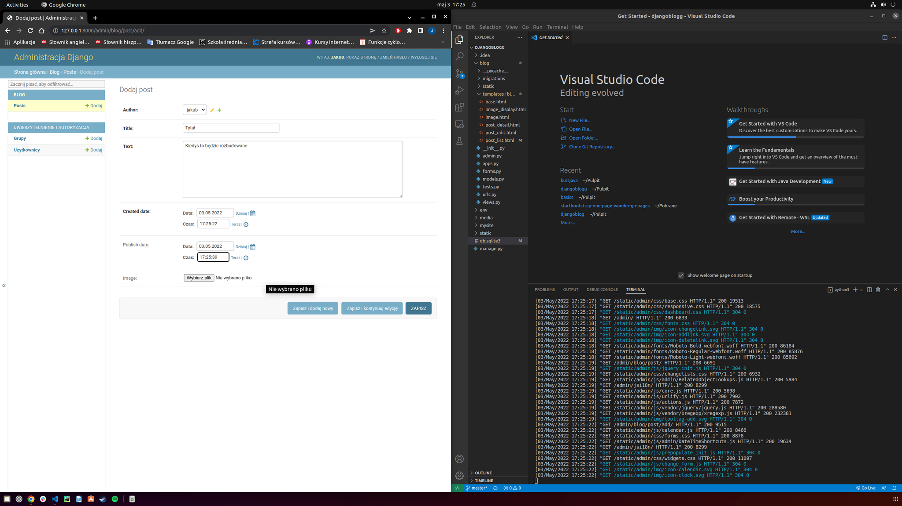
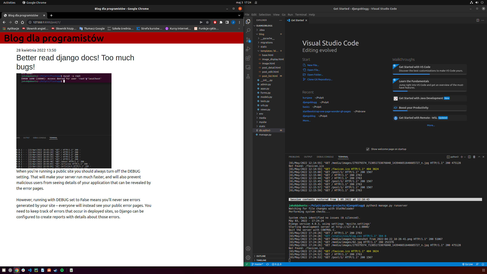

# Django Blog :computer:

This is a simple blog written in the Django framework :snake:. It allows users to create, edit, and delete posts :memo:, as well as add comments :speech_balloon:. This project aims to demonstrate the basic features of Django and their implementation in the context of a web application.

## Installation :floppy_disk:

To install and run this project, follow these steps:

1. Clone the repository to your local computer:
    ```bash
    git clone https://github.com/JRadomyski/BlogDjango.git
    ```

2. Go to the project directory:
    ```bash
    cd BlogDjango
    ```

3. Create and activate a virtual environment:
    ```bash
    python3 -m venv venv
    source venv/bin/activate
    ```

4. Install the required dependencies:
    ```bash
    pip install -r requirements.txt
    ```

5. Perform database migrations:
    ```bash
    python manage.py migrate
    ```

6. Run the development server:
    ```bash
    python manage.py runserver
    ```

After completing the above steps, the application will be available at http://localhost:8000/.

## Screenshots :camera:

Here are some screenshots of the running application:

- 
- 
- 

## Features :bulb:

- :bust_in_silhouette: User registration and login
- :pencil2: Creating, editing, and deleting posts
- :speech_balloon: Adding comments to posts
- :eyes: Viewing the list of posts
- :mag: Displaying detailed information about a single post

## Technologies :wrench:

The project was built using the following technologies and tools:

- Python :snake:
- Django :globe_with_meridians:
- HTML :bookmark_tabs:
- CSS :art:
- Bootstrap :gem:
- SQLite (database) :cd:

## Author :bust_in_silhouette:

This project was created by Jakub Radomyski in 2022.